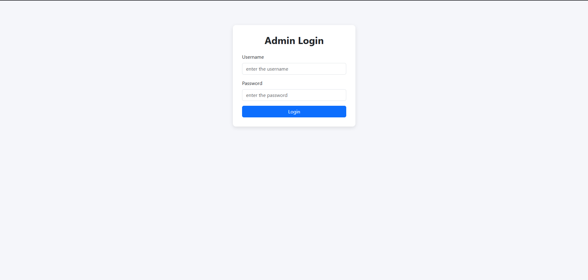
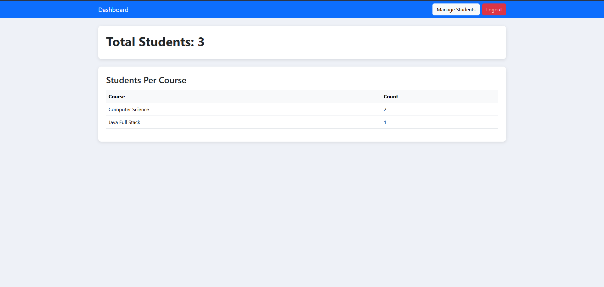
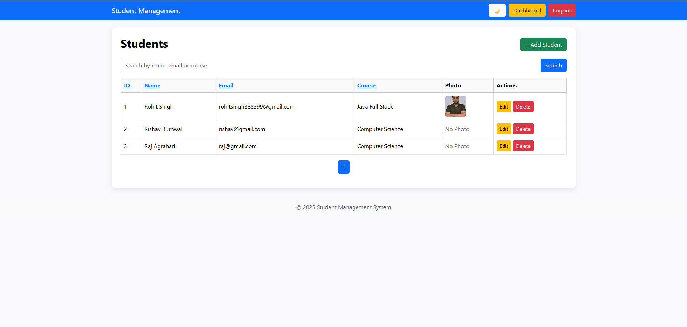

# Student Management System — Java Servlet & JSP

**A full-featured Student Management System with CRUD, login & dashboard analytics.**

## Demo Screenshots

### Login

### Dashboard

### Students List

---

## Features
- Admin login and logout
- Add / Edit / Delete students (CRUD)
- Student photo upload
- Dashboard with total students and course statistics
- Search + pagination
- Responsive layout (Bootstrap)

## Project Structure
StudentManagementSystem/
├── src/
├── WebContent/
├── screenshots/
├── .gitignore
├── LICENSE
└── README.md

## How to Run (VS Code + Tomcat)
1. Install the **Extension Pack for Java** in VS Code
2. Install **Tomcat 10**
3. Open project in VS Code
4. Right click → "Run on Tomcat Server"

## Author
Rohit Singh
